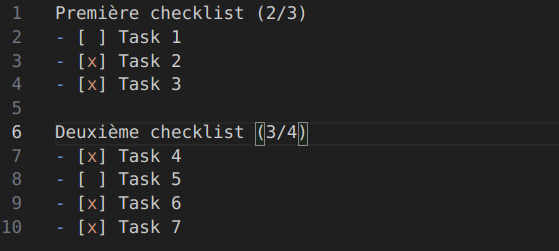

# markdown-plus

## Description

Cette extension ajoute des fonctionnalités supplémentaires pour améliorer l'édition de fichiers Markdown dans Visual Studio Code.

## Fonctionnalités

- Complète automatiquement l'avancée des checklists : 
